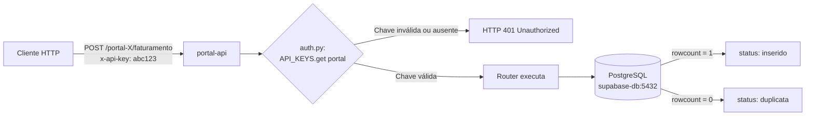
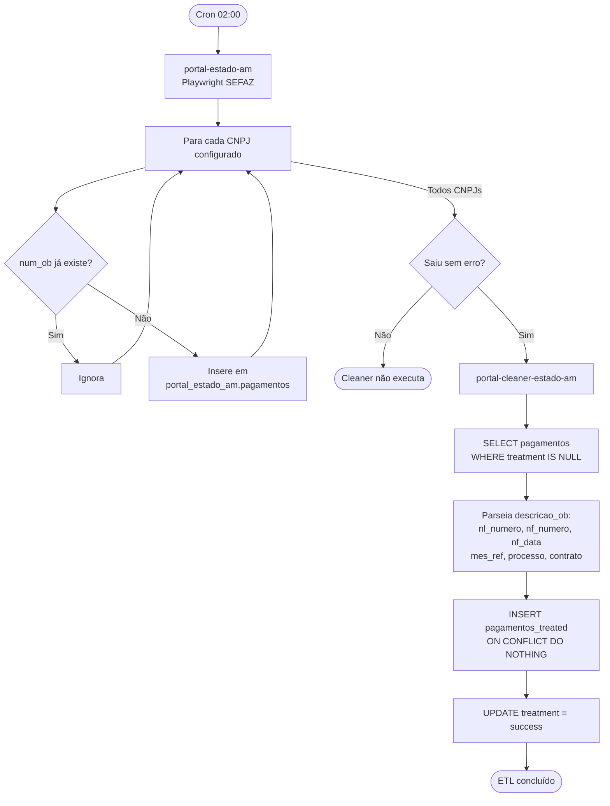

# PROJETO-SOCRATES-VPS

Sistema integrado de captura, processamento e armazenamento de documentos fiscais e dados de transparência governamental.

---

## Índice

1. [Visão Geral](#1-visão-geral)
2. [Arquitetura](#2-arquitetura)
3. [Fluxo de Dados](#3-fluxo-de-dados)
4. [Agendamento (Cron)](#4-agendamento-cron)
5. [Guia de Configuração](#5-guia-de-configuração)
6. [Fluxograma](#6-fluxograma)

---

## 1. Visão Geral

### Objetivo

O sistema automatiza o ciclo completo de tratamento de documentos fiscais emitidos para órgãos públicos municipais e estaduais do Amazonas. Ele resolve os seguintes problemas:

| Problema | Solução |
|---|---|
| Notas Fiscais em PDFs dispersos em pastas de rede | ProcessadorNF lê e estrutura os dados automaticamente |
| Credenciais do banco de dados expostas no cliente | Portal API intermediária — o cliente nunca toca o Supabase diretamente |
| Dados brutos de pagamentos no portal SEFAZ | Scrapers coletam e inserem no banco de forma automática |
| Dados de pagamentos sem tratamento para análise | Cleaners transformam e normalizam os registros por portal |
| Múltiplos portais com schemas distintos | Cada portal tem seu próprio router, schema e chave de API |

### Escopo

- **Portal Municipal Manaus** — NFS-e emitidas para a Prefeitura de Manaus (`schema: public`)
- **Portal Estado AM** — Pagamentos e empenhos via portal de transparência SEFAZ/AM (`schema: portal_estado_am`)

---

## 2. Arquitetura

### Stack Tecnológica

| Camada | Tecnologia |
|---|---|
| Banco de Dados | PostgreSQL 15 via Supabase (self-hosted, porta 8000) |
| API HTTP | FastAPI + Uvicorn (porta 9000) |
| Cliente Desktop | Python 3.12 + Tkinter (Windows) |
| Scraping Web | Playwright (Chromium headless) |
| ETL | Python + psycopg2 (direto ao banco) |
| Infraestrutura | Docker + Docker Compose (VPS 187.77.240.80) |
| Extração de PDF | pdfplumber → PyPDF2 → Tesseract OCR (fallback em cadeia) |

### Componentes e Responsabilidades

```
┌──────────────────────────────────────────────────────────────────┐
│  CLIENTE (Windows)                                               │
│                                                                  │
│  ┌─────────────────────────────────────────────────────────┐    │
│  │  ProcessadorNF (app.py)                                  │    │
│  │  GUI Tkinter · Multi-perfil · Autenticação SMB           │    │
│  │  Extração PDF · Envio via HTTP para Portal API           │    │
│  └──────────────────────────┬───────────────────────────────┘    │
└─────────────────────────────┼────────────────────────────────────┘
                              │ HTTP POST x-api-key
                              ▼
┌──────────────────────────────────────────────────────────────────┐
│  VPS (Docker Compose)                                            │
│                                                                  │
│  ┌──────────────────────────────────────────────────────────┐   │
│  │  portal-api (FastAPI · porta 9000)                        │   │
│  │  ├── /portal-municipal-manaus/faturamento                 │   │
│  │  └── /portal-estado-am/faturamento (+ pagamentos, logs)  │   │
│  └──────────────────────────┬─────────────────────────────── ┘  │
│                             │                                    │
│  ┌──────────────────────────▼─────────────────────────────── ┐  │
│  │  PostgreSQL / Supabase (porta 5432 interna)                │  │
│  │  ├── schema: public            → faturamento, pagamentos   │  │
│  │  │                               pagamentos_treated        │  │
│  │  └── schema: portal_estado_am  → pagamentos, nl_itens      │  │
│  │                                  pagamentos_treated, conf  │  │
│  └───────────────────────────────────────────────────────────┘  │
│                                                                  │
│  ┌──────────────────┐  ┌──────────────────┐                     │
│  │ portal-municipal │  │ portal-estado-am │                     │
│  │ -mao (novo7.py)  │  │ (main.py)        │                     │
│  │ Playwright/SEFAZ │  │ Playwright/SEFAZ │                     │
│  └────────┬─────────┘  └────────┬─────────┘                     │
│           │                     │                               │
│           ▼                     ▼                               │
│  ┌──────────────────┐  ┌──────────────────────────┐            │
│  │ portal-cleaner   │  │ portal-cleaner-estado-am │            │
│  │ ETL public.      │  │ ETL portal_estado_am.    │            │
│  │ pagamentos       │  │ pagamentos               │            │
│  └──────────────────┘  └──────────────────────────┘            │
└──────────────────────────────────────────────────────────────────┘
```

### Containers Docker

| Container | Script | Função | Restart |
|---|---|---|---|
| `portal-api` | `main.py` | API HTTP porta 9000 | always |
| `portal-municipal-mao` | `novo7.py` | Scraping SEFAZ Municipal | no (cron) |
| `portal-estado-am` | `main.py` | Scraping SEFAZ Estadual | no (cron) |
| `portal-cleaner` | `cleaner.py` | ETL `public.pagamentos` | no (cron) |
| `portal-cleaner-estado-am` | `cleaner_estado_am.py` | ETL `portal_estado_am.pagamentos` | no (cron) |
| `portal-aristoteles` | `main.py` | Watcher PDF (desativado) | no |

### Redes Docker

| Rede | Tipo | Membros |
|---|---|---|
| `portal_default` | bridge (interna) | Todos os serviços do portal |
| `supabase_default` | external (existente) | Serviços que acessam o banco |

### Comunicação entre Componentes

- **ProcessadorNF → portal-api**: HTTP REST com header `x-api-key`
- **portal-api → PostgreSQL**: psycopg2 direto via rede Docker (`supabase-db:5432`)
- **portal-municipal-mao / portal-estado-am → PostgreSQL**: psycopg2 direto
- **portal-cleaner / portal-cleaner-estado-am → PostgreSQL**: psycopg2 direto

---

## 3. Fluxo de Dados

### 3.1 Processamento de Notas Fiscais (ProcessadorNF)

**Ator:** Usuário do setor administrativo (Windows)

```
1. Usuário abre ProcessadorNF.exe e seleciona um ou mais perfis
2. App autentica na pasta SMB via `net use` (usuário/senha de rede)
3. Lista todos os PDFs da pasta que NÃO estão em /processados ou /erro
4. Para cada PDF:
   a. Extrai texto: tenta pdfplumber → PyPDF2 → Tesseract OCR
   b. Detecta modelo do documento: DANFSE | NOTA | FATURA
   c. Extrai campos estruturados: número, data, CNPJs, valores
   d. Converte valores BR (1.234,56) para float
   e. Consulta API: GET /{portal}/faturamento/existe/{numero}
   f. Se já existe → move para /processados (duplicata, sem reinserção)
   g. Se novo    → POST /{portal}/faturamento com JSON dos dados
   h. Se sucesso → move para /processados
   i. Se erro    → move para /erro
5. Exibe relatório na interface: inseridos / duplicatas / erros
```

### 3.2 Inserção via Portal API

**Ator:** ProcessadorNF ou qualquer cliente HTTP autorizado

```
1. Cliente envia POST /{portal}/faturamento com x-api-key no header
2. auth.py valida a chave contra a variável de ambiente correspondente
3. Router estabelece conexão psycopg2 com supabase-db
4. Executa INSERT INTO faturamento ... ON CONFLICT (numero_nota) DO NOTHING
5. Verifica rowcount: 1 = inserido | 0 = duplicata
6. Retorna JSON: {"status": "inserido" | "duplicata", "numero_nota": "..."}
```

### 3.3 Scraping Portal Municipal Manaus (portal-municipal-mao)

**Ator:** Cron 02:00 seg–sex / disparo por e-mail via platao.sh

```
1. Carrega configurações das tabelas conf, conf_cpfs, conf_exercicios
2. Para cada CPF/CNPJ × exercício configurado:
   a. Abre Playwright, navega para portal SEFAZ Municipal
   b. Coleta empenhos e pagamentos
   c. Verifica cache de números já existentes
   d. Insere novos registros em public.pagamentos
3. Envia notificação por e-mail aos destinatários em conf_emails
```

### 3.4 Scraping Portal Estado AM (portal-estado-am)

**Ator:** Cron 02:00 seg–sex

```
1. Lê configurações da tabela portal_estado_am.conf (exercicio, mês, credores)
2. Abre browser Playwright (Chromium headless)
3. Navega para portal SEFAZ/AM transparência
4. Para cada CNPJ/CPF configurado:
   a. Preenche formulário de busca
   b. Coleta lista de pagamentos (num_ob, orgão, valor, datas)
   c. Para cada pagamento, acessa detalhes e coleta NL e empenhos
   d. Verifica duplicata antes de inserir (num_ob / num_nl)
   e. Insere em portal_estado_am.pagamentos e nl_itens
5. Registra execução em portal_estado_am.execucao_logs
```

### 3.5 ETL Portal Municipal (portal-cleaner)

**Ator:** Cron imediatamente após portal-municipal-mao (`&&`)

```
1. SELECT * FROM public.pagamentos WHERE treatment IS NULL LIMIT 100
2. Para cada linha:
   a. strip_prefix em "pagamento" e "data"
   b. Extrai valor e valor_anulado da coluna valor
   c. Parseia descricao: nf_numero, nl_numero, nf_data, mes_ref, credor, tipo_retencao
   d. INSERT INTO public.pagamentos_treated ON CONFLICT (id) DO NOTHING
   e. UPDATE pagamentos SET treatment = 'success' | 'failure'
3. Registra métricas em cleaner_log
```

### 3.6 ETL Portal Estado AM (portal-cleaner-estado-am)

**Ator:** Cron imediatamente após portal-estado-am (`&&`)

```
1. SELECT * FROM portal_estado_am.pagamentos WHERE treatment IS NULL LIMIT 100
2. Para cada linha, parseia descricao_ob extraindo:
   - nl_numero  → ex. 2025NL0001591
   - nf_numero  → ex. 3530 (via lista de 35+ prefixos)
   - nf_data    → ex. 01/12/2025 ou 06/01/26
   - mes_ref    → ex. JAN/2025
   - processo   → ex. 028101.009412/2025-05
   - contrato   → ex. 43/2021
3. INSERT INTO portal_estado_am.pagamentos_treated ON CONFLICT (id) DO NOTHING
4. UPDATE pagamentos SET treatment = 'success' | 'failure'
```

---

## 4. Agendamento (Cron)

```
# Scraping + ETL — Portal Municipal Manaus (sequencial)
0 2 * * 1-5   portal-municipal-mao  &&  portal-cleaner

# Scraping + ETL — Portal Estado AM (sequencial)
0 2 * * 1-5   portal-estado-am  &&  portal-cleaner-estado-am

# Disparo manual por e-mail (qualquer horário)
*             sync_procmail verifica conf_emails a cada hora
              e-mail "atualizar portal" → platao.sh → portal-municipal-mao

# Sincronização de filtros de e-mail
0 * * * *     sync_procmail.py
```

> O operador `&&` garante que o cleaner só executa se o scraper terminar **sem erro**.

---

## 5. Guia de Configuração

### 5.1 Variáveis de Ambiente — Portal API (`api` service)

| Variável | Descrição | Exemplo |
|---|---|---|
| `DB_HOST` | Host do PostgreSQL (interno Docker) | `supabase-db` |
| `DB_PORT` | Porta do PostgreSQL | `5432` |
| `DB_NAME` | Nome do banco | `postgres` |
| `DB_USER` | Usuário do banco | `postgres` |
| `DB_PASSWORD` | Senha do banco | _(ver .env)_ |
| `API_KEY_PORTAL_MUNICIPAL_MANAUS` | Chave de acesso — portal municipal | _(ver .env)_ |
| `API_KEY_PORTAL_ESTADO_AM` | Chave de acesso — portal estadual | _(ver .env)_ |

> As variáveis são carregadas via `.env` no `docker-compose.yml`. O arquivo `.env` **não é versionado** (está no `.gitignore`).

### 5.2 Configuração dos Cleaners

Os cleaners usam arquivos `*_config.json` com credenciais do banco — **não versionados**.

| Serviço | Arquivo de config | Schema |
|---|---|---|
| `portal-cleaner` | `cleaner/cleaner_config.json` | `public` |
| `portal-cleaner-estado-am` | `cleaner-estado-am/cleaner_estado_am_config.json` | `portal_estado_am` |

### 5.3 Configuração do ProcessadorNF (cliente Windows)

O app armazena configuração em:
```
C:\Users\{usuario}\AppData\Roaming\ProcessadorNF\conf.ini
```

Estrutura do arquivo:
```ini
[PERFIL_1]
nome     = PREFEITURA MANAUS
smb_path = \\192.168.51.200\compartilhamento\PREFEITURA_MAO
usuario  = dominio\usuario
senha    = senha_smb
portal   = portal_municipal_manaus

[PERFIL_2]
nome     = ESTADO AM
smb_path = \\192.168.51.200\compartilhamento\ESTADO_AM
usuario  = dominio\usuario
senha    = senha_smb
portal   = portal_estado_am
```

A tela de configuração é protegida por senha. Para adicionar/editar perfis, acesse **Configurações** na interface.

### 5.4 Endpoints da Portal API

**Base URL:** `http://187.77.240.80:9000`

| Método | Rota | Descrição |
|---|---|---|
| `GET` | `/health` | Verifica se a API está no ar |
| `POST` | `/portal-municipal-manaus/faturamento` | Insere NFS-e municipal |
| `GET` | `/portal-municipal-manaus/faturamento/existe/{numero}` | Verifica duplicata |
| `POST` | `/portal-estado-am/faturamento` | Insere NFS-e estadual |
| `GET` | `/portal-estado-am/faturamento/existe/{numero}` | Verifica duplicata |
| `GET` | `/portal-estado-am/pagamentos` | Lista pagamentos (filtros: exercicio, mes, orgao) |
| `GET` | `/portal-estado-am/nl-itens` | Lista empenhos/NL |
| `GET` | `/portal-estado-am/resumo` | Totais e métricas |
| `GET` | `/portal-estado-am/logs` | Logs de execução |
| `GET` | `/portal-estado-am/conf` | Lista configurações |
| `PUT` | `/portal-estado-am/conf/{chave}` | Atualiza configuração |

**Autenticação:** todas as rotas (exceto `/health`) exigem o header `x-api-key`.

**Documentação interativa (Swagger):** `http://187.77.240.80:9000/docs`

### 5.5 Dependências — Build do EXE (ProcessadorNF)

```bash
pip install pyinstaller pdfplumber PyPDF2 pytesseract pdf2image Pillow requests

# Gerar EXE
pyinstaller app.py --onefile --windowed --name ProcessadorNF
```

O executável gerado fica em `dist/ProcessadorNF.exe`. Não requer instalação — basta distribuir o `.exe`.

### 5.6 Deploy no VPS

```bash
# Subir todos os serviços permanentes
cd /opt/portal
docker compose up -d

# Reconstruir um serviço após mudanças
docker compose up -d --build api
docker compose build cleaner && docker compose up -d cleaner

# Executar scraper/cleaner manualmente
docker compose run --rm portal-municipal-mao
docker compose run --rm cleaner
docker compose run --rm portal-estado-am
docker compose run --rm cleaner-estado-am

# Ver logs em tempo real
docker compose logs -f portal-api

# Status dos containers
docker compose ps
```

### 5.7 Estrutura do Repositório

```
PROJETO-SOCRATES-VPS/
├── main.py                        # Entry point FastAPI
├── auth.py                        # Validação de API keys
├── Dockerfile                     # Build da portal-api
├── docker-compose.yml             # Orquestração completa
├── .gitignore
│
├── routers/
│   ├── portal_municipal_manaus.py
│   └── portal_estado_am.py
│
├── ProcessadorNF/                 # Código-fonte do cliente Windows
│   ├── app.py
│   ├── extractor.py
│   ├── pdf_reader.py
│   ├── supabase_client.py
│   └── utils.py
│
├── cleaner/                       # ETL public.pagamentos
│   ├── cleaner.py
│   ├── cleaner_config.json        # ← não versionado (credenciais)
│   └── Dockerfile
│
├── cleaner-estado-am/             # ETL portal_estado_am.pagamentos
│   ├── cleaner_estado_am.py
│   ├── cleaner_estado_am_config.json  # ← não versionado (credenciais)
│   └── Dockerfile
│
├── aristoteles/                   # Watcher PDF (desativado)
├── portal-estado-am/              # Scraper SEFAZ Estadual
├── socrates/                      # Scraper SEFAZ Municipal (novo7.py)
└── scripts/
    ├── sync_procmail.py           # Sincronização de filtros de e-mail
    └── platao.sh                  # Disparo manual via e-mail
```

---

## 6. Fluxograma

### Fluxo Principal — ProcessadorNF

```mermaid
flowchart TD
    A([Usuário abre ProcessadorNF.exe]) --> B[Seleciona perfis na interface]
    B --> C{Senha configuração?}
    C -- Editar perfis --> D[Dialog: Configurações\nAdd / Edit / Delete perfil]
    D --> B
    C -- Processar --> E[Para cada perfil selecionado]

    E --> F[Autenticar SMB\nnet use + usuário/senha]
    F --> G{Conexão OK?}
    G -- Não --> H[Exibe erro e passa para próximo perfil]
    G -- Sim --> I[Lista PDFs na pasta\nexclui /processados e /erro]

    I --> J{PDFs encontrados?}
    J -- Não --> K[Log: nenhum arquivo]
    J -- Sim --> L[Para cada PDF]

    L --> M[Extrai texto do PDF]
    M --> M1{pdfplumber OK?}
    M1 -- Sim --> N
    M1 -- Não --> M2{PyPDF2 OK?}
    M2 -- Sim --> N
    M2 -- Não --> M3[Tesseract OCR]
    M3 --> N[Texto extraído]

    N --> O[Detecta modelo:\nDANFSE / NOTA / FATURA]
    O --> P{Modelo identificado?}
    P -- Não --> Q[Move para /erro\nLog: modelo desconhecido]
    P -- Sim --> R[Extrai campos estruturados\nnúmero, data, CNPJs, valores]

    R --> S[GET /portal/faturamento/existe/{numero}]
    S --> T{Já existe?}
    T -- Sim --> U[Move para /processados\nLog: duplicata]
    T -- Não --> V[POST /portal/faturamento\nJSON com dados da nota]

    V --> W{HTTP 200?}
    W -- Sim, inserido --> X[Move para /processados\nLog: inserido]
    W -- Sim, duplicata --> U
    W -- Erro --> Y[Move para /erro\nLog: falha na API]

    X --> L
    U --> L
    Q --> L
    Y --> L

    L -- Todos processados --> Z[Exibe relatório:\nInseridos / Duplicatas / Erros]
    K --> Z
    H --> Z
    Z --> E
    E -- Todos perfis concluídos --> AA([Processamento finalizado])
```

### Fluxo de Autenticação da Portal API



### Fluxo de Coleta e ETL — Portal Estado AM


